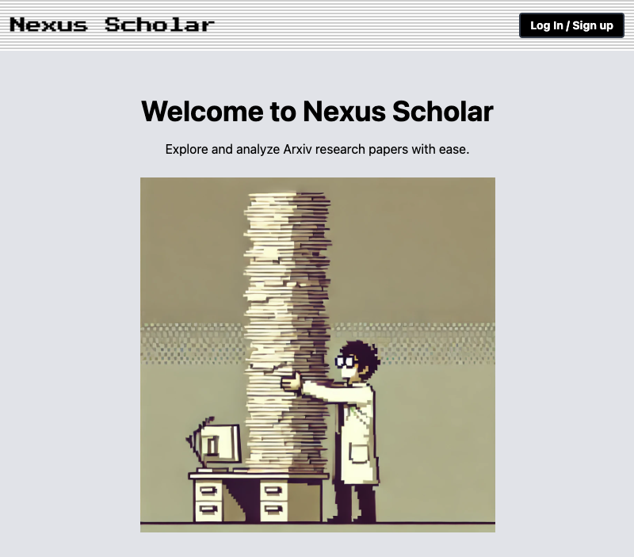

## Nexus Scholar — Frontend

Nexus Scholar is a research assistant UI that lets you load a set of papers (arXiv lookups, references, and your own PDFs) into a single chat session and ask questions across all of them.

This repository contains the React/Vite frontend. The backend (API + WebSocket) is a separate repo https://github.com/ysqander/nexus_scholar_go_backend.



### Highlights

- **Context builder**: fetch an arXiv paper, inspect references, select which to include, add extra papers, and upload your own PDFs.
- **Streaming chat**: WebSocket-based, type while the AI composes responses.
- **Session controls**: warnings, extensions, and termination with cached-data cleanup.
- **Auth**: Auth0 login/logout and protected API access.
- **Modern UI**: Tailwind CSS with a retro Mac-inspired layout.

### Tech Stack

- **React 18** with **Vite** and **React Router**
- **Auth0** for authentication
- **Axios** for API calls (with retry)
- **WebSockets** for streaming responses
- **Tailwind CSS** for styling
- **Zustand** for light state management

## Getting Started

### Prerequisites

- Node.js 18+ and pnpm 8+
- A running backend providing REST and WebSocket endpoints
- An Auth0 application (domain, client ID, audience)

### 1) Install dependencies

```bash
pnpm install
```

### 2) Configure environment

Create a `.env.local` in the project root and set the following variables:

```bash
# API base URL (backend HTTP endpoint)
VITE_API_BASE_URL=http://localhost:8000

# WebSocket base URL (backend WS endpoint)
VITE_WS_BASE_URL=ws://localhost:8000

# Auth0 configuration
VITE_AUTH0_DOMAIN=your-tenant.eu.auth0.com
VITE_AUTH0_CLIENT_ID=your-client-id
VITE_AUTH0_AUDIENCE=your-api-identifier
```

Notes:

- `VITE_API_BASE_URL` is used by Axios for REST calls.
- `VITE_WS_BASE_URL` is used to establish the chat WebSocket: `${VITE_WS_BASE_URL}/ws`.
- Auth0 variables are read in `src/main.jsx`.

### 3) Run the dev server

```bash
pnpm dev
```

Open `http://localhost:5173` in your browser.

### Build and Preview

```bash
# Production build
pnpm build

# Preview the build locally
pnpm preview
```

## Project Structure

```
src/
  assets/
  components/
    Errors/
    Session/
    ...
  hooks/
    usePaperLoader.js        # arXiv lookup, references selection, PDF uploads
  pages/
    Home.jsx
    Start.jsx
    ContextBuilder.jsx
    Chat.jsx                 # WebSocket chat UI
    ChatHistory.jsx
    Account.jsx
    Success.jsx
    HealthCheck.jsx
  utils/
    axiosConfig.js           # axios instance with retry + baseURL
  App.jsx                    # routes and layout
  main.jsx                   # Auth0 provider + router
```

## How it Works (Frontend)

- On login, users are routed to `Start` → `ContextBuilder` to assemble a session context.
- `usePaperLoader` calls the backend to fetch an arXiv paper and its references; users choose which to include and can add more papers or PDFs.
- Entering `Chat` opens a WebSocket connection to stream AI responses; session status (active/warning/expired) is handled in real time.
- Users can extend or terminate sessions, and view chat history.

## Environment & Deployment

- This is a static frontend built with Vite. After `pnpm build`, deploy the contents of `dist/` to any static host (e.g., Netlify, Vercel, S3, or behind Caddy/Nginx). A `Caddyfile` is included as an example for static serving.
- Ensure your hosting environment exposes the required `VITE_*` variables at build time, and that it can reach the backend over HTTP and WebSocket.

## Scripts

- `pnpm dev` — run the dev server
- `pnpm build` — production build to `dist/`
- `pnpm preview` — serve production build locally
- `pnpm lint` — run ESLint

## Related

- Backend service (API + WS): kept in a separate repository.

---

This project was built prior to native multi-document features becoming common in LLM tooling; it demonstrates a custom multi-paper chat workflow for research use cases.

 
